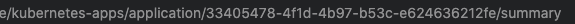

# Nutanix Karbon Platform Services action

This action updates a deployment of a application deployed on Nutanix [Karbon Platform Services](https://www.nutanix.com/products/karbon/platform-services)(KPS).

This is an example of working with the KPS API and only supports single container application deployments.

## Inputs

### `tag`

**Required** The tag that the image is tagged with in the container registry.

### `image`

**Required** The container image

### `kps-api-key`

**Required** The API key for the [KPS API](https://www.nutanix.dev/reference/karbon-platform-services/)

### `kps-app-id`

**Required** The application ID in KPS for the deployment to be updated. You can fin the APP id in the URL while configuring the application KPS UI.  


## Example usage

Using Github secrets for storing the KPS API Key

```yaml
- name: Call KPS API
        uses: voxic/simpleKPSAction
        with:
            tag: main
            image: voxic/kps-simple
            kps-api-key: ${{ secrets.kps_API_KEY }}
            kps-app-id: 33405478-4f1d-4b97-b53c-e624636212fe
```

## Example full workflow

```yaml

name: KPS CI/CD

# Only run on PUSH with a TAG
on:
  push:
    tags:
      - '*'

jobs:

  build:

    runs-on: ubuntu-latest

    steps:
      - name: Checkout code
        uses: actions/checkout@v2
      - name: Build and Push to Docker Hub
        uses: docker/build-push-action@v1
        with:
            username: ${{ secrets.DOCKER_USER }}
            password: ${{ secrets.DOCKER_PASS }}
            repository: voxic/kps-simple
            tag_with_ref: true
      - name: Get tag
        id: tag
        uses: dawidd6/action-get-tag@v1 # Community actio to get a tag from a PUSH
      - name: Call KPS API
        uses: voxic/simpleKPSAction@v1
        with:
            tag: ${{steps.tag.outputs.tag}}
            image: voxic/kps-simple
            kps-api-key: ${{ secrets.kps_API_KEY }}
            kps-app-id: 33405478-4f1d-4b97-b53c-e624636212fe

```
